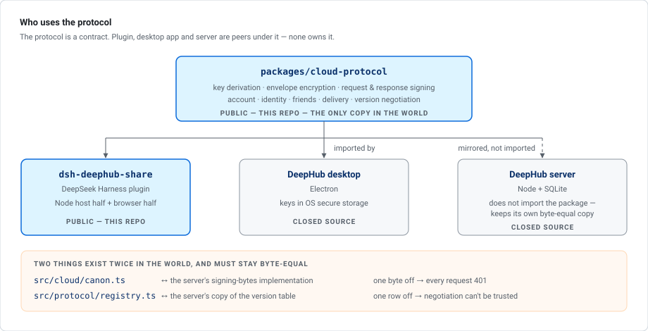
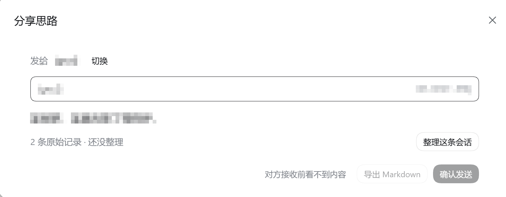
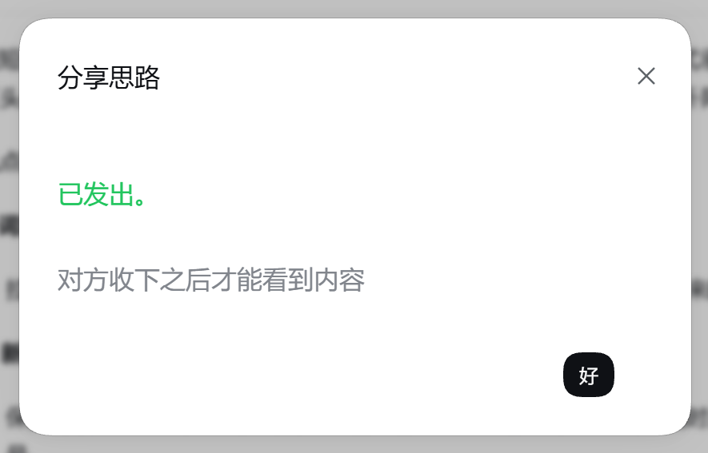
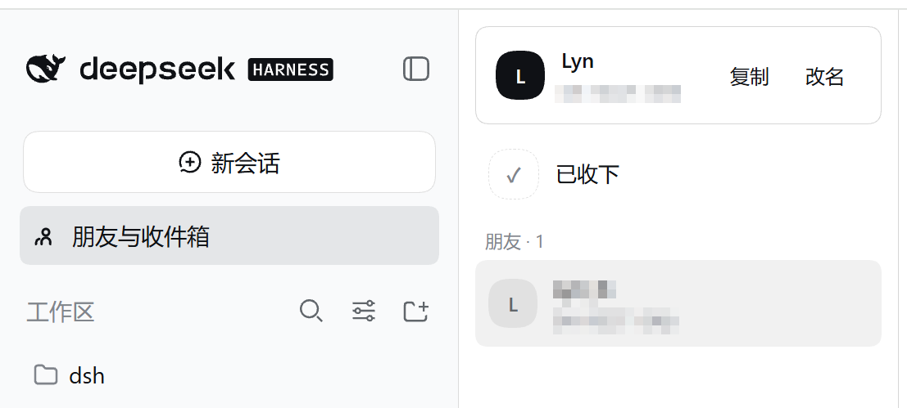
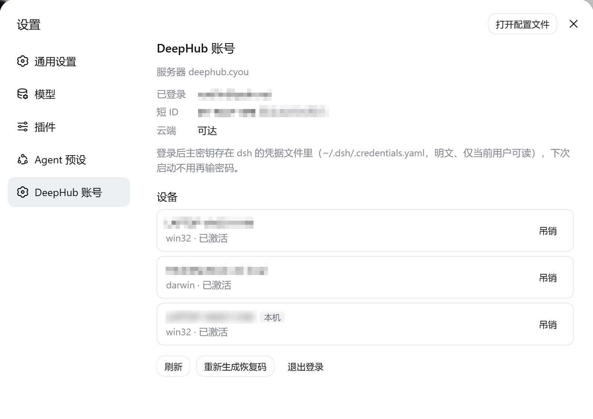
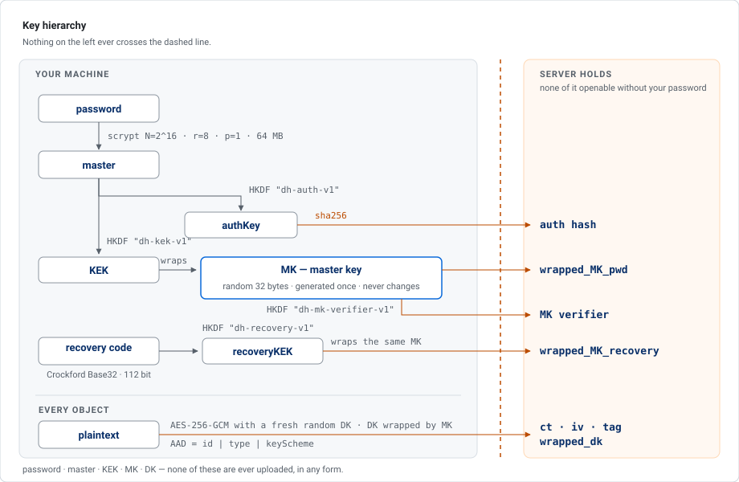

# DeepHub · the open half

<p align="center">
  
</p>

<p align="center">
  <a href="https://github.com/Voellin/dsh-deephub-share/actions/workflows/ci.yml"></a>
  <a href="LICENSE"></a>
  
  
  
  <a href="https://github.com/Voellin/dsh-deephub-share/stargazers"></a>
</p>

<p align="center">
  <a href="#feature-preview">Preview</a> ·
  <a href="#key-hierarchy">Keys</a> ·
  <a href="#quick-start">Quick start</a> ·
  <a href="#code-map">Code map</a> ·
  <a href="README.md">中文</a>
</p>

---

## What this is

DeepHub is an AI assistant that runs on your own machine. Its cloud side is a **relay for encrypted data**:
your password and master key never leave the machine, and what the server stores is ciphertext it cannot decrypt.

This repository contains the part of DeepHub that **can be verified externally**:

| Package | Contents |
|---|---|
| [`packages/cloud-protocol`](packages/cloud-protocol) | **The cloud protocol client.** Key derivation, envelope encryption, request and response signing, the account and delivery protocol. The DeepHub desktop app and the plugin below run **the same code**, not two similar implementations |
| [`packages/dsh-deephub-share`](packages/dsh-deephub-share) | A **[DeepSeek Harness](https://github.com/deepseek-ai/deepseek-harness) (dsh) plugin**: distills a conversation into an "idea", encrypts it after you confirm the redaction, and sends it to a friend on DeepHub. A received idea lands as a new conversation in dsh |

**The protocol is the subject; the plugin is its first consumer.**

> Built on DeepSeek Harness; **not an official DeepSeek plugin**.

---

## Feature preview

### Sending

The conversation header gains a "share idea" button:

<p align="center"></p>

It opens a single screen in five sections: **recipient / content / sensitive-data scan / attachments / export or send**.

<p align="center"></p>

> It initially shows only the title and record count; **the model is called only after "organise this conversation"**.
> Exporting Markdown requires no sign-in. "Send" is end-to-end encrypted — **the recipient sees nothing until they accept**.

<p align="center"></p>

### Receiving

"Friends & inbox" in the sidebar. The inbox holds **metadata only** (sender, size, attachment count, time);
the title is inside the ciphertext. "Accept" decrypts it and lands it as a new conversation:

<p align="center"></p>

### Account

Settings gains a "DeepHub account" section: sign-in state, short ID, cloud reachability,
the device list (revocable individually), and recovery-code regeneration.

<p align="center"></p>

---

## Key hierarchy

<p align="center"></p>

---

## Request and response signing

Every request is signed with the **device Ed25519 private key**; `authKey` stays off the wire in normal use and is
uploaded only at registration, new-device sign-in and password change. The bytes to be signed are length-prefixed,
so no field's contents can forge a different valid split:

```
DH-SIGN-V1 ‖ lp(host) ‖ lp(METHOD) ‖ lp(target) ‖ lp(deviceId) ‖ lp(sha256(body)) ‖ lp(u64 ts) ‖ lp(nonce)
DH-RESP-V1 ‖ lp(nonce) ‖ lp(u16 status) ‖ lp(sha256(body))

lp(x) = uint32be(len(x)) ‖ x
```

The rules live in [`src/cloud/client.ts`](packages/cloud-protocol/src/cloud/client.ts).

1. Requests are signed with the device private key.
2. A 2xx response without a valid signature is **treated as an attack and aborted**; its body is not trusted.
3. A non-2xx response without a signature is **a transport failure only**, never an authoritative answer.

The response signature binds the request's `nonce`; the nonce is generated randomly by the client and cannot be
pre-positioned, so old responses cannot be replayed.

---

## Quick start

### 1 · Install

Requires **dsh 0.1.5-rc.1 or newer** and **pnpm** on PATH (`dsh plugin` uses it to install packages).

```sh
dsh plugin --profile web add dsh-deephub-share
```

Or install the prebuilt package from a Release:

```sh
curl -LO https://github.com/Voellin/dsh-deephub-share/releases/latest/download/dsh-deephub-share.tgz
dsh plugin --profile web add ./dsh-deephub-share.tgz
```

Both are prebuilt, so neither triggers a build approval at install time. Verify:

```sh
dsh --profile web --dump-config                   # should end with a "# == dsh-deephub-share" config layer
dsh web                                           # console should print [dsh-deephub-share] host loaded … and cloud ready …
```

Uninstall:

```sh
dsh plugin --profile web remove dsh-deephub-share
```

The config layer is removed with it; the four `deephub-share/*` records in the credential file must be deleted manually.

### 2 · Create an account

Open **Settings → DeepHub account**:

1. Register with email and password → receive the code → **write down the recovery code**
   (six groups of four characters, Crockford Base32).
2. If you already have an account in the DeepHub desktop app, simply sign in: the desktop app and the dsh plugin
   count as **two devices on one account**, confirmed on a device that is already signed in.
3. After sign-in the master key is cached in dsh's credential store; subsequent starts need no password.

### 3 · Send an idea

In any conversation, click "share idea" → add a friend (exchange short IDs, formatted `DH-XXXX-XXX`;
**the other side must accept**) → "organise this conversation" → confirm the redaction → send.
The recipient clicks "accept" in Friends & inbox.

### Building from source

Contributor path — not needed to install the plugin. Requires Node **≥ 22.19** (or ≥ 24; tests run the TS sources
directly, using Node's built-in type stripping) and npm 10+ (npm workspaces monorepo — **install at the root**).

```sh
git clone https://github.com/Voellin/dsh-deephub-share.git
cd dsh-deephub-share

npm install            # must run at the repository root; workspaces links the two packages
npm run typecheck      # tsc --noEmit for each package
npm test               # 32 tests in cloud-protocol, 73 in the plugin
npm run build          # builds the plugin's two faces
```

Build output:

| File | Runtime | Format |
|---|---|---|
| `packages/dsh-deephub-share/lib/index.js` | Node (host) | ESM |
| `packages/dsh-deephub-share/lib/client.js` | dsh's UI (browser) | CJS closure factory, the shape dsh's module table requires |

**The two are loaded separately and cannot see each other**: private keys and the master key exist only in the host;
the browser can only request results from it over local HTTP.

Install a locally built package:

```sh
cd packages/dsh-deephub-share && npm pack
dsh plugin --profile web add ./dsh-deephub-share-<version>.tgz
```

### Pointing at your own server implementation

The DeepHub server is not open source. These two arguments point the client at a compatible server you implement yourself from [PROTOCOL.md](packages/cloud-protocol/PROTOCOL.md), or at a test instance.

In the profile's `cordis.patch.yml`, override them for `deephub-share`:

```yaml
- id: deephub-share
  config:
    baseUrl: http://127.0.0.1:18790      # your own compatible server
    serverPubRaw: <that server's signing public key, base64>
```

---

## Code map

| # | File | Contents |
|---|---|---|
| 1 | [`crypto/kdf.ts`](packages/cloud-protocol/src/crypto/kdf.ts) | password → master → authKey / KEK derivation; the scrypt and HKDF parameters |
| 2 | [`crypto/envelope.ts`](packages/cloud-protocol/src/crypto/envelope.ts) | the per-object random DK, the AES-256-GCM envelope, what the AAD binds |
| 3 | [`cloud/canon.ts`](packages/cloud-protocol/src/cloud/canon.ts) | the **one** definition of the bytes to be signed; the character allowlist for request targets |
| 4 | [`cloud/client.ts`](packages/cloud-protocol/src/cloud/client.ts) | signed transport, response verification rules, error classification |

Directory structure:

```
packages/cloud-protocol/
  PROTOCOL.md          version registry, evolution rules, criteria for raising the minimum
  src/crypto/          key derivation, envelopes, account key wrapping, recovery codes
  src/cloud/           signing, signing bytes, transport, account, identity, friends, delivery, negotiation
  src/keystore.ts      the interface for storing private keys on disk, plus a default implementation
  src/protocol/        the machine-readable form of the version registry
  test/                node --test, run directly against the TS sources

packages/dsh-deephub-share/
  src/                 host: routes, distillation, redaction, attachments, landing received ideas
  src/client/          browser: button, settings section, inbox panel, conversation card
  tests/               node --test, run directly against the TS sources
```

Detailed layering and the two cross-repo invariants are in [docs/ARCHITECTURE.md](docs/ARCHITECTURE.md).

---

## Resources

- **Full security write-up**: <https://deephub.cyou/security>
- **Protocol spec**: [packages/cloud-protocol/PROTOCOL.md](packages/cloud-protocol/PROTOCOL.md)
- **Architecture**: [docs/ARCHITECTURE.md](docs/ARCHITECTURE.md)
- **dsh**: [DeepSeek Harness](https://github.com/deepseek-ai/deepseek-harness)
- **Security policy**: [SECURITY.md](SECURITY.md)
- **Report a bug**: [GitHub Issues](https://github.com/Voellin/dsh-deephub-share/issues)

## License

[MIT](LICENSE) © [wanglin](https://github.com/Voellin)
