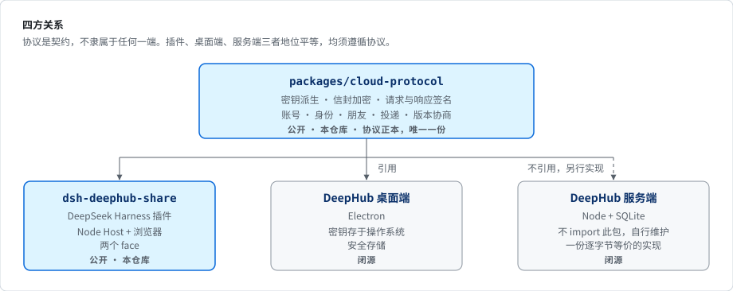

# 四方关系

<p align="center"></p>

若日后出现第四个消费者（移动端、CLI、第三方客户端），其接入方式与插件一致：引用 `packages/cloud-protocol`。

---

## 可见范围

| | 可见 | 不可见 |
|---|---|---|
| 服务端 | 密文、对象大小、时间戳、设备 id、投递的收发双方 | 密码、主密钥、思路正文、标题、好友备注、附件内容 |
| 本仓库的读者 | 协议的完整实现，以及插件的完整实现 | 桌面端与服务端的实现 |
| 取得本机访问权限者 | 见 [SECURITY.md](../SECURITY.md) 的「如何处理密钥」 | |

---

## 两条跨仓不变量

服务端**不引用**本包，而是以 JS 另行实现了一份。因此有两处逻辑在客户端与服务端各存在一份，
且**必须逐字节等价**：

| 客户端（本仓） | 服务端（闭源） | 不一致的后果 |
|---|---|---|
| `src/cloud/canon.ts` | 服务端的待签字节实现 | 待签字节不匹配 → **全部请求返回 401**；服务端刻意不区分认证失败的原因，排查困难 |
| `src/protocol/registry.ts` | 服务端的版本表副本 | 协议版本表不一致 → 协商结果不可信 |

两份实现分属不同语言与运行时，无法合并，改由私有仓中的一份交叉校验断言保证：
逐一比对 1260 组请求待签串、220 组响应待签串与 15 个 target 判定用例，存在一个字节的差异即失败。
该校验直接读取本仓的 `.ts` 源码，不依赖任何构建产物。

协议部分不接受外部 PR 亦出于同一原因：修改 `canon.ts` 的任意一行，服务端必须同时更新对应实现，
否则所有用户无法登录。

---

## 插件的两个 face

dsh 插件被装载为两个独立的 face，**分别装载、互相不可见**：

| | 运行环境 | 职责 | 可否接触密钥 |
|---|---|---|---|
| Host `lib/index.js` | Node | 全部路由、调用模型、读取会话日志、加解密、文件落盘 | **可以**——私钥与主密钥仅存在于此 |
| 浏览器 `lib/client.js` | dsh 的界面 | 会话头按钮、设置分区、收件箱面板、会话流卡片 | **不可以**——只能通过本机 HTTP 向 Host 请求结果 |

---

## 目录

```
packages/cloud-protocol/
  PROTOCOL.md          版本登记簿、演进规则、抬升最低支持版本的判据
  src/crypto/          密钥派生、信封、账号密钥包裹、恢复码
  src/cloud/           签名、待签字节、传输、账号、身份、朋友、投递、版本协商
  src/keystore.ts      私钥落盘的接口与默认实现（宿主可注入更强的封装）
  src/protocol/        版本登记簿的机器可读形式

packages/dsh-deephub-share/
  src/                 Host：路由、整理、脱敏、附件、收下落地
  src/client/          浏览器：按钮、设置分区、收件箱面板、会话卡片
  tests/               node --test，直接运行 TS 源码
```
